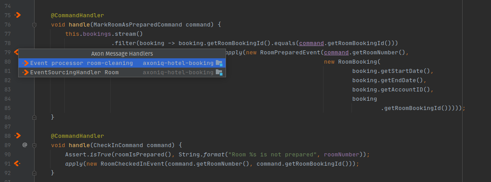
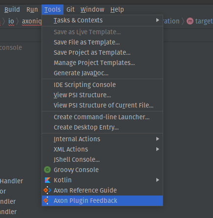

Axon Framework IntelliJ Plugin
===================================
<!-- Plugin description -->
Supports developers while writing applications using [Axon Framework](https://axoniq.io/product-overview/axon-framework) version 4.x.

Axon Framework helps build scalable, extensible, and maintainable applications by supporting developers to apply Domain-Driven Design (DDD),
Command-Query Responsibility Separation (CQRS), and Event Sourcing (ES). The framework provides a message-driven architecture with dedicated
command, event, and query messages, to support these paradigms.

The plugin provides the following features:

- Line markers to visualize commands, events, queries and deadlines
- Several inspections on code structure that is required for Axon Framework
- Marks methods used by Axon Framework as used, such as annotated methods
- Easy access to the reference guide (ctrl+shift+a and type axon)

If you have a feature request or want to report a bug, please report this at
our [Github issue tracker](https://github.com/AxonFramework/IdeaPlugin/issues).

For questions on Axon Framework usage, or about the plugin, please visit our [Discuss](https://discuss.axoniq.io/).
<!-- Plugin description end -->

## Usage

Download and install the plugin manually from the [IntelliJ Plugin Website](https://plugins.jetbrains.com/plugin/18628-axon-framework) or
use the Plugin Repository Browser in your IDE.

After installation the plugin will automatically annotate the [Axon Framework](http://www.axonframework.org/)
annotations it recognizes. You can click on the icons on the left of the sourcecode to navigate to and from the annotations.

### Submitting Errors and Feedback

When an error happens while using the plugin, IntelliJ will show an error report window. Please send us these reports. They are anonymous
and are sent to [Sentry.io](https://sentry.io). We would like to thank Sentry for the Sponsored account!

In addition, you can report feedback on usage of the plugin via the "Tools" menu, as illustrated below. This feedback is also processed
in [Sentry.io](https://sentry.io).

## Local development

You can run an IntelliJ instance with the plugin locally with `./gradlew runIde`. This will bootstrap a clean instance and load the plugin.
While the instance is running, you can run `./gradlew buildPlugin` for a hot reload of the plugin.

To check compatibility with the most common IntelliJ versions run `./gradlew runPluginVerifier`.

## Development process

- Features are developed on branches
- The pull request should contain a changelog entry added to the "Unreleased" section
- When ready for release, `CHANGELOG.md` and `gradle.properties` are updated with the new version
- A tag is created with name `vx.x.x` on that commit and pushed. Github Actions will automatically publish that version

There are no minor release branches, since we don't need patch versions on older versions of the plugin. Users will always update to the
latest version and will ignore earlier patches, so the `master` branch is leading.

